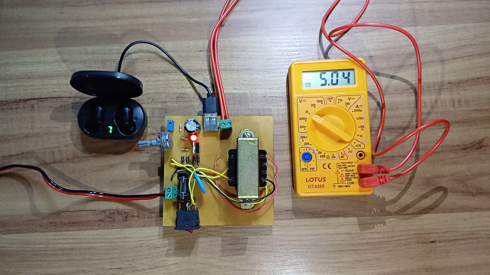
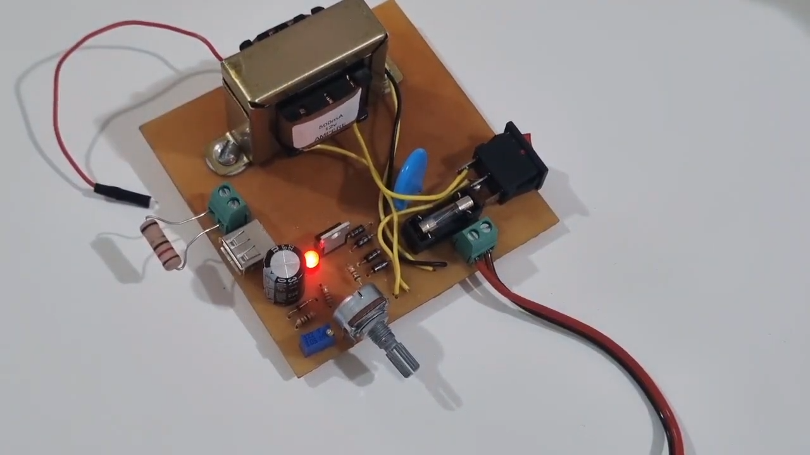
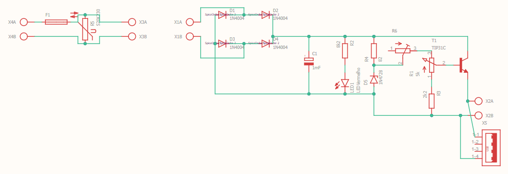
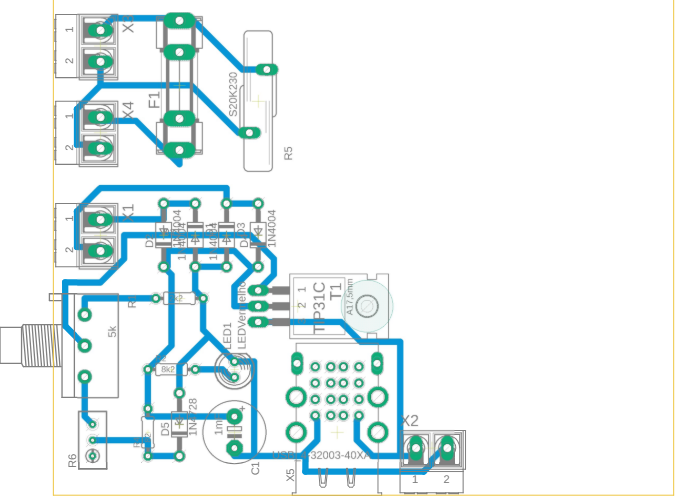
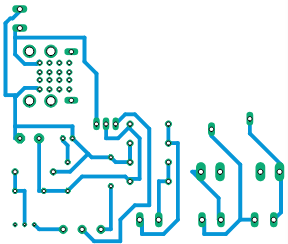

# Voltage Regulator Power Supply Project

## Description
Rectifier power supply that converts alternating current with an effective voltage of 127V into direct current with an adjustable voltage between 3V and 12V.

## Group
 - [Bernardo Alexandre Alves Rodrigues](mailto:bernardorodrigues@usp.br)
 - [Gabriel Phelippe Prado](mailto:gabriel.phelippe@usp.br)
 - [Gabriel Campanelli Iamato](mailto:gabriel.c.iamato@usp.br)
 - [Henrique Vieira Lima](mailto:vieira.henrique@usp.br)

## Information
 - **Course:** Electronics for Computing
 - **Professor:** Eduardo do Valle Simões
 - **Degree:** Bachelor’s in Computer Science
 - **Class:** BCC-A / 2024 

## Project
 - Watch the project in action in this [video](https://youtu.be/LmAK9lCr3QM)

 - Watch the project explanation in this [video](https://youtu.be/v0-GvNXRQ9Q?si=ZIwsNRWMdKinU6Kj)

## Prototype
 - Watch the project explanation in this [vídeo](https://youtu.be/MAERgxqwMdY?si=GL7MvnJlF9lUfxt0)

## Component List
| Quantity | Components        | Price (R$) |
|----|---------------|------------|
| 1x | Fuse                   | R$1,00 |
| 1x | Varistor               | R$2,40 |
| 1x | Transformer 12V 0.5A   | R$41,00 |
| 4x | Diode 1N4001           | R$0,19 x 4 = R$0,76 |
| 1x | Capacitor 1mF 35V      | R$2,00 |
| 1x | Red LED 5mm            | R$0,45 |
| 1x | Resistor 2.2k          | R$0,07 |
| 1x | Resistor 8.2k          | R$0,07 |
| 1x | Resistor 470           | R$0,72 |
| 1x | Trimpot 500            | R$2,81 |
| 1x | Zener Diode 13V 0.5W   | R$0,35 |
| 1x | Potentiometer 5k       | R$6,70 |
| 1x | Transistor TIP 31 C    | R$3,70 |
| 1x | Push Button Switch     | R$2,90 |
| 2x | 2-pin Terminal Block   | R$2,20 |
| 1x | USB-A Connector        | R$3,30 |
| 1x | Phenolic Board         | R$7,80 |
| 1x | AC Plug 10A            | R$5,80 |
| 1x | Wire 0,5mm             | R$4,50 |
| **Total** |                 | **R$88,53** |

 - Components purchased from [Ca And Ma](https://www.caandma.com.br/) in São Carlos/SP.

## Component Functionality
 - **Fuse:** A safety device that interrupts the flow of electrical current in a circuit when it exceeds the allowed limit, protecting the circuit against current surges.
 - **Varistor:** An electronic component whose resistance varies according to the voltage applied to its terminals. As the voltage increases, the resistance decreases. Varistors are used to protect electronic devices from voltage spikes.
 - **Transformer:** A device that uses electromagnetic induction to increase or decrease electrical voltage while maintaining power. Transformers work exclusively with alternating current. In the rectifier circuit, the transformer reduces the 127V (from the wall outlet) to 24V.
 - **Diode Bridge:** Converts alternating current (AC) into direct current (DC). It consists of four rectifier diodes connected in a specific configuration that allows current to flow in only one direction.
 - **Capacitor:** Stores electrical charge. In the regulator, during the AC cycles, it releases current when its internal voltage is greater than the voltage from the diode bridge. It discharges when the cycle inverts. The capacitor was selected for a desired ripple of 10%. After calculations, a capacitance of 416.7µF was obtained. Thus, we chose the commercial value of 470µF.
 - **Led:** A diode that converts electricity into light. In this circuit, it indicates when the power supply is turned on.
 - **Resistors:** Electronic components that regulate the amount of electricity flowing through a circuit. They decrease the current intensity and reduce voltage along a wire.
 - **Zener Diode:** A component that regulates the maximum voltage. It conducts current only when the input voltage reaches its nominal voltage, in this project 12V. If the voltage is below 12V, no current passes through the Zener diode, so it does not affect the circuit.
 - **Potentiometer:** An adjustable resistor. It allows selecting the output voltage, between 3V and 12V.
 - **NPN Transistor:** A semiconductor device that can amplify electrical currents, generate oscillations, and more. In this project, it allows the adjustable flow of current.
 - **Switch:** An electrical switch can be either closed or open. When closed, current flows through the circuit; when open, it does not. This enables turning the power supply on and off.

## Circuit Simulation - Falstad
 - Access the simulation via this [link](https://tinyurl.com/2fm74n5c)
 - Or, in the menu `File > Import from Text` of [Falstad](https://falstad.com/circuit/circuitjs.html), open the file `./Arquivos/circuitoFalstad.txt` from the repo

## Circuit Schematic - Eagle
 - Download [Eagle](https://www.autodesk.com/products/eagle/overview)
 - In the menu `File > Open > Schematic...`, open the file `./Arquivos/esquematicoEagle.sch` from the repo

## PCB - Eagle
 - Download [Eagle](https://www.autodesk.com/products/eagle/overview)
 - In the menu `File > Open > Schematic...`, open the file `./Arquivos/pcbEagle.brd` from the repo

    
    

## License
This project is licensed under the GNU General Public License V3.0, published by the Free Software Foundation.
