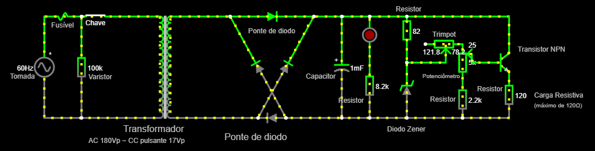
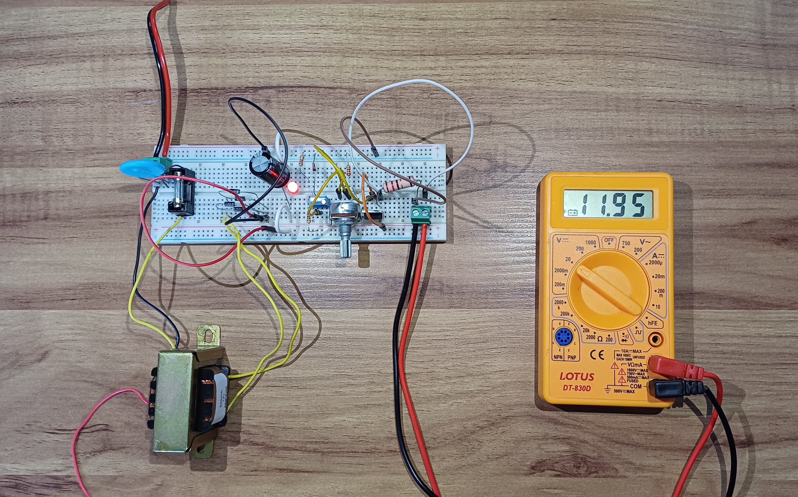

# Projeto Fonte Reguladora De Tensão

## Descrição
Fonte retificadora de tensão que transforma corrente alternada com tensão eficaz de 127V em corrente contínua com tensão ajustável entre 3V e 12V.

## Grupo
 - [Bernardo Alexandre Alves Rodrigues](mailto:bernardorodrigues@usp.br)
 - [Gabriel Phelippe Prado](mailto:gabriel.phelippe@usp.br)
 - [Gabriel Campanelli Iamato](mailto:gabriel.c.iamato@usp.br)
 - [Henrique Vieira Lima](mailto:vieira.henrique@usp.br)

## Informações
 - **Disciplina:** Eletrônica para Computação
 - **Professor:** Eduardo do Valle Simões
 - **Curso:** Bacharelado em Ciência da Computação
 - **Turma:** BCC-A / 2024 

## Vídeo do projeto
Adicionar link do vídeo no Youtube

## Lista de Componentes
| Quantidade | Componentes        | Valor (R$) |
|----|---------------|------------|
| 1x | Fusível                | R$1,00 |
| 1x | Varistor               | R$2,40 |
| 1x | Transformador 24V 0.5A | R$41,00 |
| 5x | Diodo 1N4001           | R$0,19 x 4 = R$0,76 |
| 1x | Capacitor 470µF 35V    | R$2,65 |
| 1x | Led Vermelho 5mm       | R$0,45 |
| 1x | Resistor 2.2k          | R$0,07 |
| 1x | Resistor 1k            | R$0,07 |
| 1x | Resistor 1k 1W         | R$0,39 |
| 1x | Resistor 120 5W        | R$1,70 |
| 1x | Resistor 82            | R$0,72 |
| 1x | Diodo Zener 13V 0.5W   | R$0,35 |
| 1x | Potenciômetro 5k       | R$6,70 |
| 1x | Transistor TIP 31 C    | R$3,70 |
| 1x | Chave Tecla            | R$2,90 |
| 2x | Borne 2 vias           | R$2,20 |
| 1x | Plug AC 10A            | R$5,80 |
| 1x | Fio 0,5mm              | R$4,50 |
| **Total** |                 | **R$77,36** |

 - Componentes comprados na loja [Ca And Ma](https://www.caandma.com.br/) em São Carlos/SP.

## Funcionamento dos Componentes
 - **Fusível:** dispositivo de segurança que interrompe a passagem de corrente elétrica num circuito quando esta ultrapassa o limite permitido, de modo a proteger o circuito quando há picos de corrente.
 - **Varistor:** componente eletrônico que varia a sua resistência elétrica de acordo com a tensão aplicada aos seus terminais. Na medida em que a tensão aumenta, a resistência diminui. Os varistores são utilizados para proteger os aparelhos eletrônicos de picos de tensões.
 - **Transformador:** dispositivo que utiliza a indução eletromagnética para aumentar ou diminuir a tensão elétrica enquanto mantém a potência. Os transformadores funcionam exclusivamente com correntes alternadas. No circuito da fonte retificadora, o transformador reduz a tensão de 127V (proveniente da tomada) para 24V.
 - **Ponte de Diodo:** permite a conversão de corrente alternada (AC) em corrente contínua (DC). Ela é composta por quatro diodos retificadores conectados em uma configuração específica que permitem que a corrente flua em uma única direção.
 - **Capacitor:** é usado para armazenar carga elétrica. Na fonte reguladora, durante os ciclos da corrente alternada, libera corrente quando a tensão interna é maior do que a tensão advinda da ponte de diodo. Ele descarrega quando ocorre uma inversão de ciclo. O capacitor foi escolhido com um ripple desejado de 10%. Após os cálculos, foi-se obtido uma capacitância de 416,7uF. Assim, escolhemos o valor comercial de 470uF.
 - **Led:** diodo que converte eletricidade em luz. Nesse circuito, possui a função de indicar quando a fonte está ligada.
 - **Resistores:** componente eletrônico que regula a quantidade de eletricidade que flui por um circuito. O resistor diminui a intensidade da corrente elétrica e reduz o potencial elétrico ao longo de um fio.
 - **Diodo Zener:** componente que regula a tensão máxima. Ele irá conduzir corrente somente quando a tensão de entrada alcança a sua tensão nominal, que, no caso deste projeto, é de 12v. Caso a tensão seja menor do que 12V, não haverá corrente passando pelo diodo Zener; assim, ele não interferirá no circuito.  
 - **Potenciômetro:** componente eletrónico com resistência elétrica ajustável. Ele permitirá a escolha da tensão de saída, entre 3V e 12V.
 - **Transistor NPN:** dispositivo semicondutor que pode amplificar correntes elétricas, gerar oscilações elétricas e outros. Nesse projeto, possui a funcionalidade de permitir a passagem da corrente elétrica de forma ajustável.
 - **Chave:** uma chave elétrica pode estar num dos dois estados: fechado ou aberto. Quando a chave está fechada, a corrente elétrica passa pelo circuito; quando está aberta, a corrente elétrica não passa. Assim, podemos ativar ou desativar o funcionamento da fonte.

## Simulação do Circuito - Falstad
 - Acesse a simulação no [Falstad](https://tinyurl.com/29guzw5a)
 - Ou, no menu `File > Import from Text`, acesse o arquivo `./Arquivos/circuitoFalstad.txt` do repositório

## Esquemático do Circuito - Eagle
 - Acesse o software [Eagle](https://www.autodesk.com/products/eagle/overview)
 - No menu `File > Open > Schematic...`, acesse o arquivo `./Arquivos/esquematicoEagle.sch` do repositório
 - Adicionar Imagem

## PCB do Circuito - Eagle
 - Acesse o software [Eagle](https://www.autodesk.com/products/eagle/overview)
 - No menu `File > Open > Schematic...`, acesse o arquivo `./Arquivos/pcbEagle.brd` do repositório
 - Adicionar Imagem

## Protótipo
 - Assista ao funcionamento do protótipo pelo [vídeo](https://youtu.be/MAERgxqwMdY?si=GL7MvnJlF9lUfxt0)

## Licença
Esse projeto está licenciado sobre a GNU General Public License V3.0, publicada pela Free Software Foundation.
